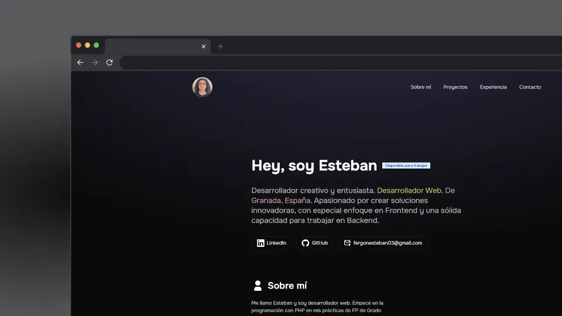

Desplegado en: https://consultorialocal.es/dev-steban-portfolio/ 

# ¡Hola! Soy Esteban, desarrollador web 👨‍💻

Soy un apasionado de la programación con interés en crear soluciones modernas, eficientes y adaptativas. Me especializo en tecnologías como **HTML5**, **CSS3**, **JavaScript**, **React**, **Vue**, **Angular** y **Astro**, con un enfoque en la creación de interfaces intuitivas y responsivas. También tengo experiencia en el desarrollo de aplicaciones del lado del servidor con **Java**, **.Net**, **Node.js**, **Express**, **Python**, **PHP** y **Laravel**, además de gestionar bases de datos con **MySQL**, **MariaDB** y **MongoDB**.

A lo largo de mis proyectos, he trabajado en la implementación de funcionalidades y en la creación de aplicaciones web. Mi enfoque es siempre aprender y mejorar mis habilidades en desarrollo web. Además, me esfuerzo por seguir las mejores prácticas de desarrollo y estar al tanto de las últimas tendencias tecnológicas.

En mi portfolio encontrarás ejemplos de proyectos que he desarrollado, demostrando mi capacidad para transformar ideas en soluciones funcionales y visualmente atractivas. Estoy siempre buscando nuevos retos y colaboraciones que me permitan seguir creciendo profesionalmente.

🚀 **Tecnologías que utilizo:**
- Frontend: **HTML5**, **CSS3**, **JavaScript**, **React**, **Vue**, **Angular**, **Astro**, **TailwindCSS**, **Bootstrap**.
- Backend: **Java**, **.Net** **Node.js**, **Express**, **Python**, **PHP**, **Laravel**.
- Bases de datos: **MySQL**, **MariaDB**, **MongoDB**.
- Control de versiones: **Git**, **GitHub**.

📫 **Contacta conmigo:**
- Email: [fergonesteban03@gmail.com]
- LinkedIn: [https://www.linkedin.com/in/estebanfernandezgonzalez/]

## 📝 Inspiración by [midudev](https://github.com/midudev)
